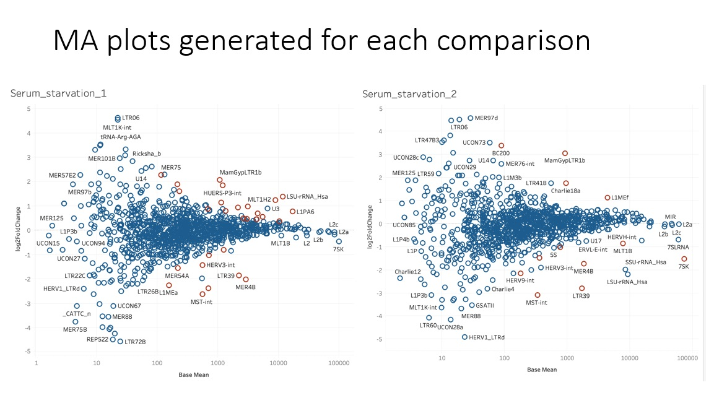

# repseqs - SWE4S Final Project
What can repeated elements in cells tell us about quiescence?  Look at the file *EL_edits_2019-12-10_RepEnrich_quiescence_software_engineering.pptx* to see our entire final presentation but below are a few example slides:





## Data Cleaning and Processing
The folder raw_data in this repository has data that has already been processed below is a sketch of how that processing occured and how this project workflow was in total


## Modules, Scripts, and Files
*data_sort.py*:  The data for this project is held in 40 folders that each have three files in them: (1) a class fraction count file, (2) a family fraction count file, (3) a fraction count file.  data_sort.py uses the file sampleinfo_pairings2.csv to group the data in these folders according to the experiment they correspond to.  The experiments involve various imposed enviornmental factors like serum starvation, mek inhibition, etc.  data_sort.py utilizes the pandas dataframe package of python. The inputs of this module are the folders contained in data/raw_data/ in this repository.  This module has now output.

*data_cat.py*:  This modules builds off of data_sort.py and takes the groupings given by the module to created concatinated .csv files that have all samples with the same experimental treatment together. data_cat.py utilizes the pandas dataframe package of python. This module requires the data_sort.py module and outputs 18 .csv files.

*sampleinfo_pairing2.xlsx*: an excel file that maps the sample ID to the type of experiment performed

## Example of Running Code
The modules in this program are designed to handle the data of this project.  Therefore, the user must download the appropriate data from the data/raw_data folder in this repository.  To run the modules, the user may use the following commands

```
python data_sort.py
python data_cat.py
```
